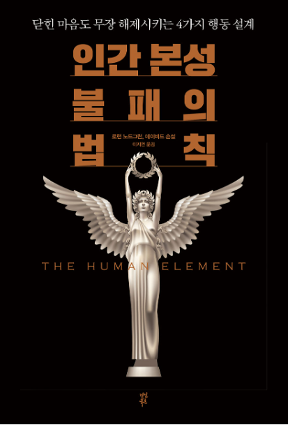

# Book Reflection: [Human Element]

#### Book Info
- Title: "Human Element: 인간 본성 불패의 법칙"
- Book Link: https://www.yes24.com/Product/Goods/114945933
- Author: Loran Nordgren, David Schonthal
- Publisher: 다산북스 https://www.yes24.com/Product/Search?domain=ALL&query=%eb%8b%a4%ec%82%b0%eb%b6%81%ec%8a%a4&mkEntrNo=281689
- Pages: 488 (ebook)
- Time to read: 7 Days
- Image from https://epreview.yes24.com/preview/viewer/viewer.html?ebookcode=1539035&dm=yes24.com

## Summary
- 제가 생각하는 이 책의 주제는 성공적인 의사 결정을 위해 추진력에만 집중하는 실수를 피하고 정서적 마찰력을 줄이는 것도 고려해야 한다는 점이라고 생각합니다.
- 책에서 의미하는 추진력은 더 많은 기능, 더 많은 혜택 등과 같이 어떤 의견을 제안하는 사람의 입장에서 생각했을 때 좋아 보이는 것들입니다.
- 책에서 의미하는 정서적 마찰력이란 이러한 추진력에 대해 반발하여 생기는 반발심리를 포함하여, 다양한 원인에 의해 발생할 수 있지만 쉽게 드러나지 않는 심리적 저항력입니다.
- 이와 관련한 다양한 사례를 책에서 소개하고 있으며, 일상 생활부터 기업 내부 및 기업과 기업 사이에서 발생했거나 그럴 가능성이 있는 예시를 기억에 쉽게 남도록 설명하고 있습니다.
---
- I believe the main theme of this book is the importance of not only focusing on drive for successful decision-making but also considering the reduction of emotional friction. The book defines drive as things that appear favorable from the perspective of someone proposing an opinion, such as more features and greater benefits.

- Emotional friction, as defined in the book, encompasses psychological resistance that arises in opposition to such drive. It can be caused by various factors but is often subtle and not easily apparent. The book introduces various cases related to this and explains examples that are memorable, ranging from everyday life to occurrences within companies and between companies, or potential situations thereof.

## Overall Impression
- 빠르면 하루, 길어도 3일 안에 다 읽게 될 정도로 잘 저술된 책이라고 생각합니다.
- 친하거나 가까운 사이의 사람들에게 추천하고 싶은 책이며, 개인적으로는 업무 분야와 상관 없이 모든 사람이 읽었으면 좋겠다고 생각합니다.
- 책에서도 강조하고 있고 개인적으로도 가장 크게 와닿은 부분은 "공감"에 대한 부분입니다. 공감 능력은 단순히 상대방의 입장에서 생각만 하는 것이 아닌, 문제를 해결한다는 측면에서 얼마나 노력할 수 있는지에 대한 지표라고 생각합니다.
- 정서적 마찰력을 발견하는 법과 그 사례에 대해 잘 서술되어 있습니다. 개인적으로 드는 생각은 해당 정서적 마찰력을 어떻게 점수화 (정량화) 할 수 있을까에 대한 부분입니다. 수치화하기 힘들지만 만약 가능하다면 조직 내와 조직간 소통 건강도를 측정하는 부분에서 좋은 지표가 될 수 있을 것으로 생각합니다.
- 제품을 만드는 사람 입장에서 생각해 보았을 때, 정서적 마찰력을 가장 잘 발견할 수 있는 방법은 그 제품을 직접 사용해보는 것이라고 생각합니다.
- 또한, IT관련 업무와 협업 관점에서 생각해 보았을 때, 정서적 마찰력을 발견할 수 있는 좋은 방법은 진심으로 꼼꼼하게 코드 리뷰를 해주거나 서로 작업하는 주 분야를 바꾸어보는 것이라고 생각합니다.
---
- I consider the book to be well-written to the extent that one could finish reading it in a day if swift, or within three days at most. I would recommend it to close friends or acquaintances and personally believe that everyone, regardless of their field of work, would benefit from reading it.

- One of the emphasized and personally resonant aspects in the book is the discussion on "empathy." I view empathy not merely as considering the other person's perspective but as an indicator of how much effort one can put into solving problems from that perspective.

- The book adeptly describes methods for identifying emotional friction and provides well-articulated examples. Personally, I find myself contemplating how one could quantify (quantify) this emotional friction. Although challenging to measure, if feasible, I think it could serve as a valuable metric in assessing communication health within and between organizations.

- Considering it from the perspective of someone involved in product development, the most effective way to identify emotional friction, in my opinion, is to directly experience the product. Furthermore, from an IT-related work and collaboration standpoint, I believe that genuinely thorough code reviews or swapping roles within the team's main tasks are excellent methods for discovering emotional friction.

## Critique
- 예시가 주로 마케팅 분야에 한정되어 있는 부분이 아쉽지만, 이는 가독성을 높이고 공감대 형성을 위해 의도된 것으로 생각합니다.
- 추후 내용이 보완되거나 관련된 책이 출판된다면, IT기업들에 대한 사례들이 더 추가되었으면 좋겠습니다. 또한 동양과 서양의 업무 문화와 소통 방식의 차이에 대해서도 관련된 내용이 추가되면 좋겠습니다.
---
- While it is regrettable that the examples are primarily confined to the field of marketing, I believe this was intentional to enhance readability and foster a sense of empathy.

- It would be desirable for future content to be augmented or for related books to be published, incorporating additional cases concerning IT companies. Moreover, it would be beneficial if the content included insights into the differences in work culture and communication styles between Eastern and Western contexts.